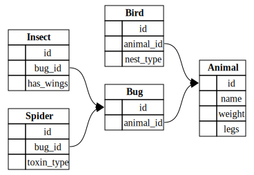

# Natural SQL Project

This is a school project for BYU's CS452 course in database modeling concepts. This project attempts to convert natural language into SQL and provide results with the use of OpenAI.

## Database Schema

I used SQLite for my database, but the filled in database file and the sql used to create it are in this repo.

This database is a simple representation of different animals. Namely Birds and bugs, bugs are further subdivided into two groups, spiders and insects. As you can see in the picture below there are a few different attributes that are stored for every animal.

## Sample Questions and Responses

The first example below is a working example of a question that was provided to the program, the sql query it generated, and the user friendly response it returned.

The second example is an example that didn't work with a brief explanation of what went wrong.

### Example 1

Q Excluding centipedes and millipedes, what is the average number of legs each animal has in the database?

A The average number of legs for animals in the database, excluding centipedes and millipedes, is 5.2.

### Example 2

Q What percentage of animals in this database have wings?

A Approximately 16.67% of the animals in this database have wings.

#### Explanation

This answer is not correct. There are multiple ways to interpret this question, but even the most conservative approach should show at least 25% of the animals as having wings. The SQL generated was gibberish. SELECT (COUNT(DISTINCT a.id) * 100.0 / (SELECT COUNT(*).

## Explanation of Prompting Strategies Used

Originally I was going to just go with a zero shot prompt strategy. I just provided that database structure and started asking question. While some tasks were obvious, without being able to see a little bit of example data the model struggled to create good SQL. So I then switched to a few-shot kind of approach. I didn't provide any sql, but I provided a few rows from each table in the database so it knew what kind of data was there. This helped it know how to better format its SQL queries.

## How To Run

Since the sqlite .db file is included in the repo you don't need to worry about generating the database.

You need an open api key stored in a file called secretKey.

Simply run the python script `NaturalLanguage.py` and answer the prompts provided to get some information from the database.
